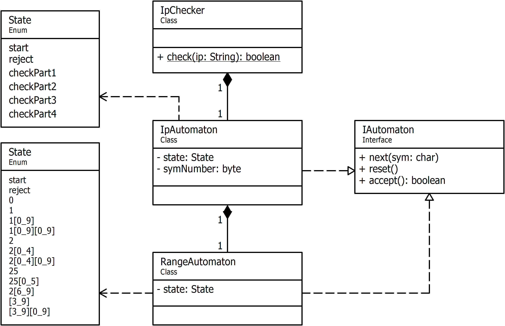
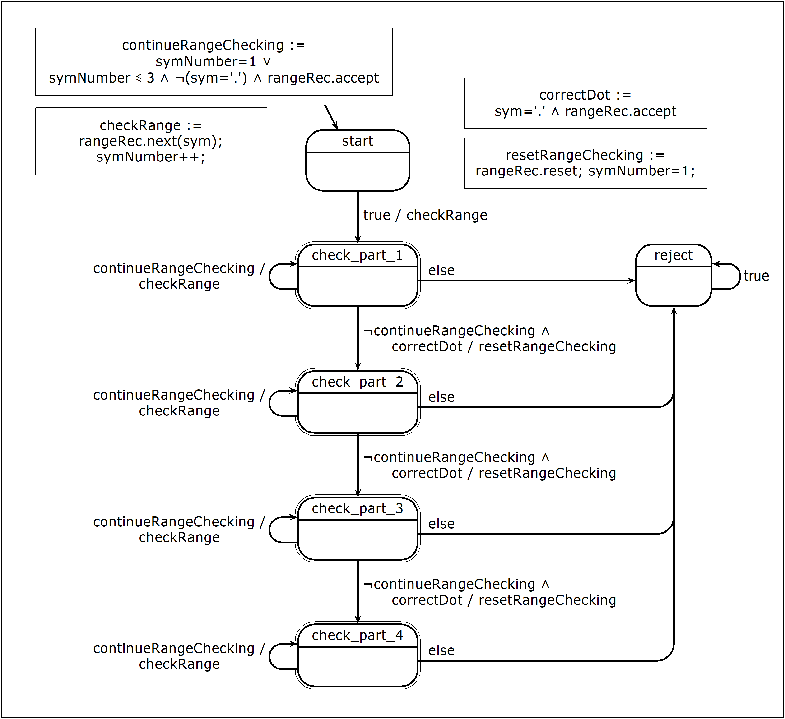
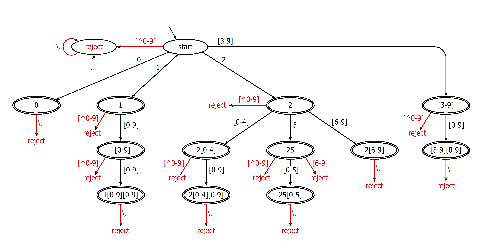

## UML-диаграмма классов.

Класс [`IPChecker`](./Code/IPChecker.java) предоставляет статический метод `check` для проверки корректности IP-адреса.
Данный класс содержит в себе главный автомат (один экземпляр класса [`IpAutomaton`](./Code/IpAutomaton.java)), который последовательно (согласно состояниям `checkPart1...checkPart4` из перечисления `State`) распознаёт четыре части IP-адреса.

Главный автомат, в свою очередь, содержит в себе подчинённый автомат (один экземпляр класса [`RangeAutomaton`](./Code/RangeAutomaton.java)), распознающий корректность значения вводимого числа. Число должно находится в диапазоне [0..255]. Состояния автомата представляют собой разбиение этого диапазона согласно перечислению `State`.

Оба автомата реализуют интерфейс [`IAutomaton`](./Code/IAutomaton.java), который позволяет:
- подать на вход автомата очередной символ (метод `next`),
- сбросить автомат в начальное состояние (метод `reset`),
- проверить допустимость введённой последовательности символов (метод `accept`).

[//]:-------------------------------------------------------------------------

## Автомат-распознаватель IP-адреса (класс [IpAutomaton](./Code/IpAutomaton.java))

### Граф переходов автомата:

IP-адрес состоит из четырёх частей – каждая часть проверяется в соответствующем состоянии `checkPart1...checkPart4`.
Данные состояния являются **акцепторными** (допускающими) – указаны двойной линией.
Переход между ними выполняется при подаче разделителя – точки.

При поступлении очередного символа на вход автомат может выполнить одно из трёх действий:
1) Продолжить проверку диапазона (действие `checkRange` при условии `continueRangeChecking`);
2) Прекратить проверку и перейти к следующему диапазону (действие `resetRangeChecking` при условии `correctDot`);
3) Отклонить входную последовательность и прекратить работу (переход в состояние `reject`).

Переменная `symNumber` указывает номер ожидаемого входного символа при проверке диапазона.

Автомат-распознаватель IP-адреса обращается к подчинённому автомату `rangeRec`, вызывая его методы.

[//]:-------------------------------------------------------------------------

## Автомат-распознаватель диапазона [0..255] (класс [RangeAutomaton](./Code/RangeAutomaton.java))

### Граф переходов автомата:

Условные обозначения (как в регулярных выражениях):
- `[0-9]` – любая цифра от `0` до `9`;
- `[^0-9]` – любой символ, не являющийся цифрой от `0` до `9`;
- `\.` – любой символ.

На вход автомата подаётся последовательность символов, которая представляет целое число.
Автомат определяет входит ли это число в диапазон [0..255], не производя числовую интерпретацию полученных символов.
Каждое состояние автомата соответствует диапазону, в который входит число, представленное последовательностью символов, которая была подана на вход.

**Примеры:**
1. При подаче входной последовательности `"249"` автомат проходит ряд состояний:
`start -> 2 -> 2[0-4] -> 2[0-4][0-9]`. Данное состояние является допускающим, поэтому данная последовательность принимается.

2. При подаче входной последовательности `"256"` автомат проходит ряд других состояний:
`start -> 2 -> 25 -> reject`. Данное состояние не является допускающим, поэтому данная последовательность отклоняется.